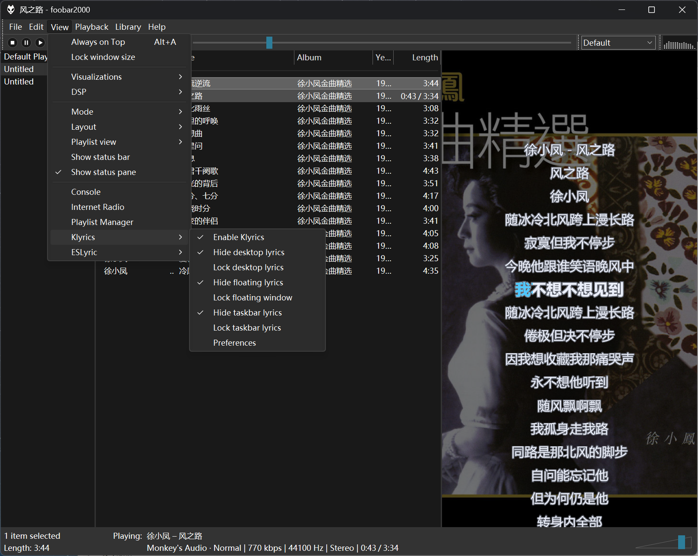
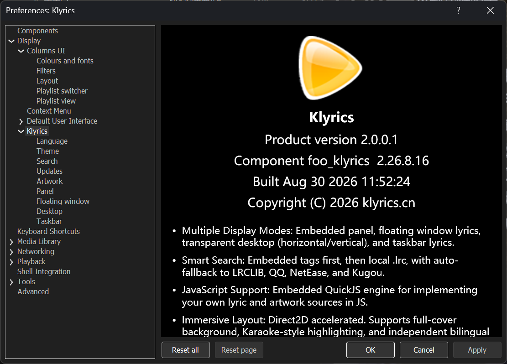
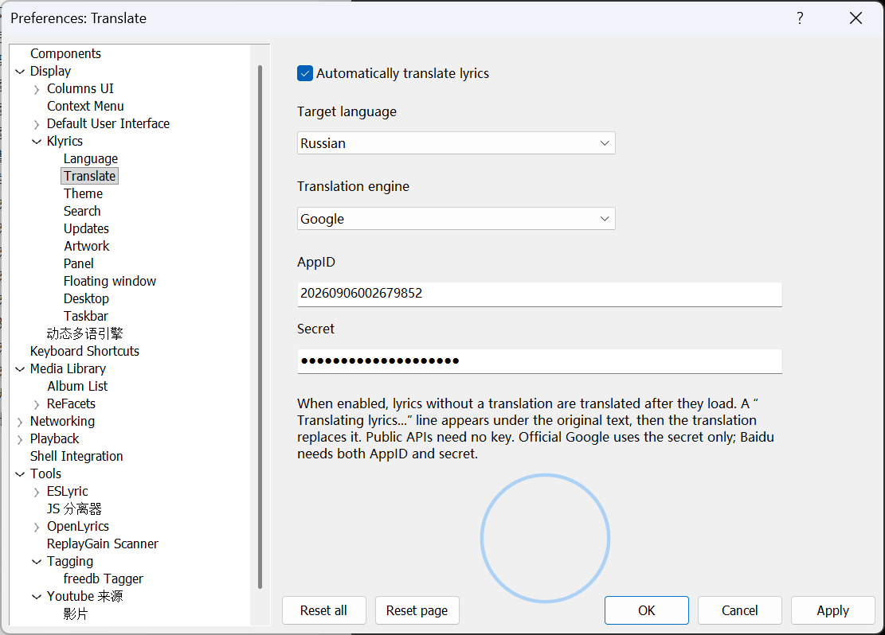
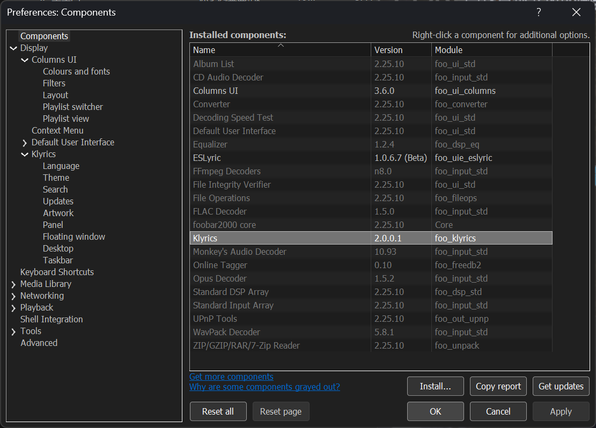

<p align="right"><b>English</b> · <a href="README_zh.md">中文</a></p>

# Klyrics (foo_klyrics)

A visual lyrics component for foobar2000: an embedded panel, transparent desktop lyrics, and Windows taskbar lyrics. Lyrics come from local `.lrc` / `.ttml` files and the In-use sources. Factory order starts with NetEase / Kugou / QQ **word-level** community scripts, then [LRCLIB](https://lrclib.net), Kugou, QQ, and NetEase line LRC. Embedded tags, amlldb TTML, and YouTube captions start in Available. Sources not added are not searched. Supports standard LRC, Enhanced LRC (inline `<>` word times), and Apple / AMLL lyric TTML (furigana, translation, and romaji are independently toggled from the panel menu); karaoke clips to the current glyph when word timestamps exist. Chinese display name **快乐歌词**.

File versions: Windows `2.26.9.14`, macOS `2.26.9.14`. Product version `2.0.0.12`.

This repository hosts **release binaries** and open community JS scripts. The component source is not published. Get the installers from the repo **Releases** page.

## Updates

### 2.0.0.12 (2026-09-13)

- Adjustable line spacing for desktop lyrics; when displayed in pairs, the spacing between the two lines follows this setting. 
- Added API commands for the lyrics service: silent lyric search, lyric selection/editing window, layer management, saving, preferences page, desktop/floating window/taskbar display and locking, seek/jump to position, and panel styling. 
- Embedded COM type library; compatible with JSplitter 3.8+. 
- Added a native WebSocket service for Windows/macOS (default: 127.0.0.1:9999; can be disabled or the port changed via the "Update" preferences page). 
- Provided a WebSocket lyrics client `klyrics_client.js`) and implemented a demo for rendering lyrics using this client `klyrics.js` and `klyrics.html`).

### 2.0.0.11 (2026-09-12)

- Desktop lyrics now support new alignment options and line-breaking effects.
- Tabs on the Preferences page have been converted into independent sub-pages within the preferences tree.
- "Panel" has been renamed "Panel Template" and now serves solely as the default appearance when creating a new panel.

### 2.0.0.10 (2026-09-12)

- Fixed a bug in version 2.0.0.9 where the lyrics panel was missing from the CUI interface in the 32-bit version of fb2k 2.x.
- Corrected the default settings for initial installation; it now defaults to the "Classic Dark" theme. 
- In the preferences, the lyrics settings have been moved from the "Display" node to the "Tools" node. 
- OBS (and streaming software based on OBS, such as Douyin Live Companion) can now capture the desktop lyrics window and the floating lyrics window. 
- The "Artwork" tab now controls only the search function; whether a background image is rendered is determined by the background mode of the individual window. 
- Added an "Image" option for panel and floating window backgrounds: supports automatically searched album art or artist photos, or a user-specified image; display modes include Center, Stretch, Fill, and Tile. 
- Added a "Filter" function to the search tab: automatic searches are skipped if the title or album name contains text from the list (case-insensitive; filtering by album is ignored if the album field is empty; manual searches are unaffected). 
- Added two new visual effects for panels and floating windows: "Fan" and "Dial."

### 2.0.0.9 (2026-09-11)

- Online lyric translation: searched lyrics can be translated into a target language automatically
- Other components and JScript Panel can pull the current lyrics through COM (`Klyrics.Engine`) on Windows
- Two push events: lyrics loaded (line count and file path; path is empty for embedded lyrics or when nothing was saved to disk); current line on line change (index, time, text, translation)

### 2.0.0.8 (2026-09-10)

- Breaking change: font size used to be calculated in points (pt); it is now in pixels (px)
- macOS builds cover both Intel and Apple Silicon
- foobar-sdk 1.x support; foobar2000 1.x is supported
- Three new community plain-text lyric sources: LyricsMania, Dark Lyrics, and 歌詞 Wiki (Available by default)
- Stroke width is adjustable and off by default; the stroke algorithm is improved
- Line spacing is set in pixels (4 px factory default); bilingual original/translation rows and wrapped rows sit tighter
- **Wrap overflow** is now on by default
- The macOS panel context menu matches Windows: **Follow global settings** is gone

Factory defaults changed, but your saved settings are left alone. To pick up the new look, hit **Apply** once under **Preferences → Display → Klyrics → Theme**.

### 2.0.0.7 (2026-09-06)

- Added fisheye and rotating diskc effects
- Optimized the design of context menu items and the layout of the preference page window
- Add an option to disable automatic saving of lyrics, while the default option for saving lyrics remains to save them to a specified directory
- Add the theme "Follow foobar2000" and apply global fonts and colors

### 2.0.0.6 (2026-09-05)

- Apple / AMLL TTML: parse local `.ttml` (furigana, translation, romaji) and add the amlldb TTML source (Available by default)
- Smoother panel / floating-window scroll: no pause at line changes; interludes keep moving
- YouTube captions: paste a watch / Music URL in the title box; if there is no CC, timed YouTube Music lyrics are fetched as standard LRC
- Star Wars effect (Windows panel / float): one slope across the view so the current line matches the receding half; the near side is no longer inverted
- Local lyrics sit beside embedded tags and are only searched when added to In use

### 2.0.0.5 (2026-09-04)

- Panel / floating window can **wrap overflow** (off by default): wrap to the window width, up to 3 lines per text; karaoke no longer pans left/right when wrap is on
- Fonts, colors, and drawing styles go into themes (including wrap); apply / export take them along
- Desktop / taskbar stroke is drawn from the same outline, with less fringe
- Default save folder is only `{foobar profile}/klyrics-data/download`; no ProgramData / Application Support store or symlink
- Search can save lyrics next to the audio file; the Chinese UI no longer falls back to English strings

### 2.0.0.4 (2026-09-03)

- Factory search starts with NetEase / Kugou / QQ word-level scripts, then LRCLIB and each site’s line LRC; scripts convert to Enhanced LRC before drawing
- Karaoke clips to the current glyph when word timestamps exist; desktop lyrics can fade after pause/stop
- Default save folder is `{foobar profile}/klyrics-data/download`, linked at startup to the shared store (Windows: `%ALLUSERSPROFILE%\Klyrics\download`; macOS: `~/Library/Application Support/Klyrics`)
- Factory community scripts are bundled and written to `klyrics-data/scripts/` on first launch (existing files are left alone)
- The lyric search window can open Preferences on the Search page

### 2.0.0.3 (2026-09-01)

- Embedded lyrics are an optional search source (Available by default; once in In use, they follow that list’s order)
- Search can **Write to file tags**; the panel menu has **Write lyrics to audio file**
- External CUE tracks: lyrics are stored on the referenced audio and read back from there. Writing while that image is playing may hitch briefly

### 2.0.0.2 (2026-08-31)

- You can place several panels; each can use **This panel appearance** or **Follow global settings**
- Double-click a panel or use **Fullscreen** on the context menu; Esc exits (overlay window, layout unchanged)
- **Enable Klyrics** on the View menu and panel menu is the master switch
- While layout editing, right-click shows foobar’s Cut / Replace menu instead of the component menu
- Floating-window hover now shows a tinted rounded background, toolbar, and corner handles; no seek bar and lyrics are no longer dimmed

## Screenshots

### Windows










### macOS


## Supported players


| Item          | Requirement                                                                                                                                           |
| ------------- | ----------------------------------------------------------------------------------------------------------------------------------------------------- |
| OS            | Windows 10 / 11; macOS 11+                                                                                                                            |
| Player        | **Windows: foobar2000 2.0+** (32-bit or 64-bit); **Mac: foobar2000 2.6+**                                                                             |
| UI            | Windows: **Default UI** and **Columns UI** can host the panel (CUI needs [Columns UI](https://yuo.be/columns-ui)). macOS uses the player’s own layout |
| Not supported | foobar2000 1.x; Windows components cannot be loaded on Mac and vice versa; no vertical taskbar lyrics; no taskbar lyrics on macOS                     |


32-bit and 64-bit are two different DLLs. Do not mix them.


| Player                    | Component file          | Install folder                                             |
| ------------------------- | ----------------------- | ---------------------------------------------------------- |
| foobar2000 2.x **32-bit** | `foo_klyrics.dll`       | `%APPDATA%\foobar2000-v2\user-components\foo_klyrics\`     |
| foobar2000 2.x **64-bit** | `foo_klyrics.dll`       | `%APPDATA%\foobar2000-v2\user-components-x64\foo_klyrics\` |
| foobar2000 **Mac**        | `foo_klyrics.component` | `~/Library/foobar2000-v2/user-components/`                 |


## Install

1. Open this repo’s **Releases** page and download the package for your OS.
2. In foobar: **File → Preferences → Components → Install**, then pick the DLL / `.fb2k-component` / `.component`. On Windows, if both bitnesses sit in one folder (or one `.fb2k-component`), Install picks the matching DLL.
3. Or copy the file into the folder above and **restart** foobar2000.

A typical 64-bit Windows path:

```
C:\Users\<name>\AppData\Roaming\foobar2000-v2\user-components-x64\foo_klyrics\foo_klyrics.dll
```

Remove old `foo_klrc` folders or `foo_klrc.dll` / `foo_klrc64.dll` so two copies are not loaded at once.

Add the panel:


| UI                   | How                                                                                                                                                       |
| -------------------- | --------------------------------------------------------------------------------------------------------------------------------------------------------- |
| **Default UI (DUI)** | Layout edit mode → insert UI element **Klyrics** (Chinese UI: **快乐歌词**)                                                                                   |
| **Columns UI (CUI)** | Install Columns UI, set the user interface module to Columns UI in Preferences → Display, and restart. Layout edit → add panel → **Panels** → **Klyrics** |


While layout editing is on, a right-click on the lyrics panel shows foobar’s Cut / Replace menu, not the Klyrics menu. You can place several panels; each can have its own **This panel appearance**.

Desktop lyrics, taskbar lyrics, menus, and Preferences do not depend on DUI/CUI. Taskbar lyrics are Windows-only.

## Features

- **Panel**: follow-playback scroll, karaoke highlight, album/artist art, paired bilingual lines. Background can be theme / transparent / custom color / image (Center, Stretch, Fill, Tile). Several panels can each have their own appearance; wrap overflow is on by default and can be turned off. Double-click or the context menu opens fullscreen (Esc exits). **Enable Klyrics** on the View menu / panel menu is the master switch. Windows and macOS both support Star Wars, fisheye, and record effects (any effect locks Always smooth scroll). The record effect can take an optional background (none by default); samples are in `[extras/](extras/)`
- **Desktop lyrics**: transparent until hover; horizontal or vertical layout, seek bar, KTV stroke, 3D shadow, image fill. Can fade after pause or stop
- **Floating window**: borderless; fully transparent until hover shows a tinted background and toolbar (no seek bar); background can also be theme / transparent / custom color / image; wrap overflow and effects can be enabled separately on this page
- **Taskbar lyrics** (Windows only): one line in the free taskbar gap
- **Lyric search**: local `.lrc` / `.ttml` and In-use sources (factory includes NetEase / Kugou / QQ word-level scripts, then LRCLIB / Kugou / QQ / NetEase / Embedded / amlldb TTML / YouTube captions); sources not added are not searched. Search → **Filter** skips auto-search when the title or album contains a listed word (case-insensitive; empty album is not filtered by album). Manual search can preview before applying. Save is a single choice: do not save / write tags / song folder / custom folder
- **Artwork search**: iTunes and others; separate from lyric search
- **Timing editor**: stamp timestamps on lyrics
- **Online translation**: searched lyrics can be translated into a target language automatically (Baidu / Google and others; see Preferences → Translate)
- **External API**: C++ SDK (Windows / macOS), COM `Klyrics.Engine` (Windows only, for JScript Panel and similar hosts), and a local WebSocket (`127.0.0.1:9999`, can be turned off). You can pull the current lyrics, or search, open windows, change layers, save, open a preferences page, and control desktop / float / taskbar lyrics. See the [lyric engine SDK](docs/sdk.en.md) and [sdk/klyrics_api.h](sdk/klyrics_api.h)

The View menu group follows the UI language: **快乐歌词** in Chinese, **Klyrics** in English.

### Where lyrics come from

After a track opens, lyrics are looked up in this order. If none hit, In-use sources are searched automatically (best match applied, no dialog). Auto-search is skipped when the title or album contains a word from Search → Filter (case-insensitive; empty album is not filtered by album). Local lyrics still load; manual Search lyrics is not blocked. When skipped, the panel shows only track info.

1. The track’s folder
2. `lyrics/<artist>/` under the save folder
3. Extra paths from Preferences
4. In-use search sources, in list order (factory: NetEase / Kugou / QQ word-level, then LRCLIB / Kugou / QQ / NetEase). Word-level scripts convert each site’s format to Enhanced LRC before drawing. Embedded lyrics, amlldb TTML, and YouTube captions sit beside the online sources, start in Available, and are only read when added to In use. If you already saved a source list, move new scripts from Available to In use under Search → Sources

Search save is a single choice: do not save / write tags / song folder / custom folder. **Write lyrics to audio file** on the panel menu writes the current lyrics. External CUE stores per-track fields on the referenced audio, not in the `.cue` text. `.lrc` files accept `[mm:ss.xx]` line stamps and inline `<mm:ss.xx>` word stamps (Enhanced LRC, one phrase per line). Local Apple / AMLL `.ttml` is also accepted (furigana, translation, romaji under **Lyric language**). Saves still write `.lrc`, not TTML.

### Panel drag

Embedded panel only. A click with no movement is ignored.


| Keys  | On release                                                              |
| ----- | ----------------------------------------------------------------------- |
| None  | Seek to the preview time                                                |
| Ctrl  | Shift **all** timestamps so the line under the crosshair **starts now** |
| Shift | Same, from that line through the end                                    |


### Editor shortcuts

Active when the editor has focus (do not use Space to stamp).


|                           | Windows         | macOS         |
| ------------------------- | --------------- | ------------- |
| Stamp and go to next line | F8              | Opt+D         |
| Re-stamp current line     | Shift+F8        | Shift+Opt+D   |
| Clear timestamp           | F7              | Opt+A         |
| Current line ±0.2 s       | Ctrl+− / Ctrl++ | Opt+W / Opt+S |


On Mac, F7 / F8 are system media keys and cannot stamp.

## Preferences

**File → Preferences → Tools → Klyrics** (Chinese UI: **快乐歌词**)

Language, Translate, Theme (including **Follow foobar2000**), Search, Artwork, Panel template, Floating window, Desktop, and Taskbar (Windows only). The Search page keeps only “When a new track starts…”; Save lyrics / Extra folders / Sources / Filter are child pages. Panel template / float / desktop / taskbar keep fonts and colors on the parent page; Effects is a child page. Panel / float background can be theme, transparent, custom color, or image. The Artwork page only controls search. Fonts, colors, and drawing styles go into themes (including wrap). On Windows, click **Apply** after changes. On macOS, changes apply immediately. First install applies Classic Dark.

Default download folder: `{foobar profile}/klyrics-data/download` (a real folder; no ProgramData or symlink).

## Community scripts

LRCLIB, Kugou, QQ, and NetEase are built in and cannot be replaced by scripts. Extra lyric or artwork sources can be `.js` files in:

- Windows: `%APPDATA%\foobar2000-v2\klyrics-data\scripts\`
- macOS: `~/Library/foobar2000-v2/klyrics-data/scripts/`

This repo’s `[scripts/](scripts/)` folder has examples: `lyricsovh.js` (lyrics), `netease-yrc.js` / `kugou-krc.js` / `qq-qrc.js` (word-level → Enhanced LRC), `amlldb-ttml.js` (amlldb TTML), `youtube-captions.js` (YouTube CC / Music timed lyrics), `lyricsmania.js` / `darklyrics.js` / `lyricsfandom.js` (three plain-text lyric sites), and `deezerart.js` (covers / artist photos). Copy them in, restart foobar, and move the source to **In use** on the Search or Artwork page.

Writing guide: [Community Script Guide](docs/script-guide.en.md).

## Lyric engine SDK

Other components can read lyrics that Klyrics has already parsed, aligned, and translated, and can send service commands (silent search, picker / editor, layers, save, preference pages, desktop / float / taskbar, panel style). C++ header: [sdk/klyrics_api.h](sdk/klyrics_api.h). Full notes, COM / WebSocket map, and a JScript Panel demo: [lyric engine SDK](docs/sdk.en.md). Browser canvas sample: [sdk/klyrics.html](sdk/klyrics.html) ([sdk/klyrics_client.js](sdk/klyrics_client.js) API layer + [sdk/klyrics.js](sdk/klyrics.js) renderer).

## Record backgrounds

The record effect has no background by default. Download `disk1c.png` (or the other disc images) from `[extras/](extras/)` and pick it in Panel / Floating window **Effects → Properties**.