# 快乐歌词（foo_klyrics）

foobar2000 视觉歌词组件：内嵌面板、透明桌面歌词、Windows 任务栏歌词。歌词来自本地 `.lrc` 和首选项「使用中」的源。出厂先走网易云 / 酷狗 / QQ **逐字**社区脚本，再 [LRCLIB](https://lrclib.net)、酷狗、QQ、网易云逐行源；内嵌歌词默认在可用源。未加入的源不会搜。支持标准 LRC 与 Enhanced LRC（行内 `<>` 逐字时间）；卡拉 OK 有字戳则按字形裁到当前字。英文显示名 **Klyrics**。

当前组件文件版本：Windows `2.26.9.1`，macOS `2.26.9.1`。产品版 `2.0.0.3`。English: [README_en.md](README_en.md)。

本仓库只托管**编译包**和开源的社区 JS 脚本，不公开插件源码。安装包在仓库的 **Releases** 页。

## 更新

### 2.0.0.3（2026-09-01）

- 内嵌歌词改为可选搜索源（默认在可用源，加入使用中后按列表顺序使用）
- 搜索页可「写入到音乐标签」；面板右键「把歌词写入音乐文件」
- 外置 CUE 分轨：词写到镜像音频的分轨字段，搜索内嵌时从镜像读；正在播放该镜像时可能顿一下

### 2.0.0.2（2026-08-31）

- 布局里可放多块面板，各块可「此面板外观」单独设置，或「跟随全局设置」
- 双击面板或右键「全屏」，ESC 退出（另开覆盖窗，不改布局）
- 查看菜单 / 面板右键增加「启用快乐歌词」总开关
- 布局编辑时右键交给 foobar，可剪切 / 替换，不再被组件菜单挡住
- 浮窗悬停改为半透明圆角底 + 工具栏 + 四角锚点，不再画进度条、不再压暗歌词

## 截图

### Windows

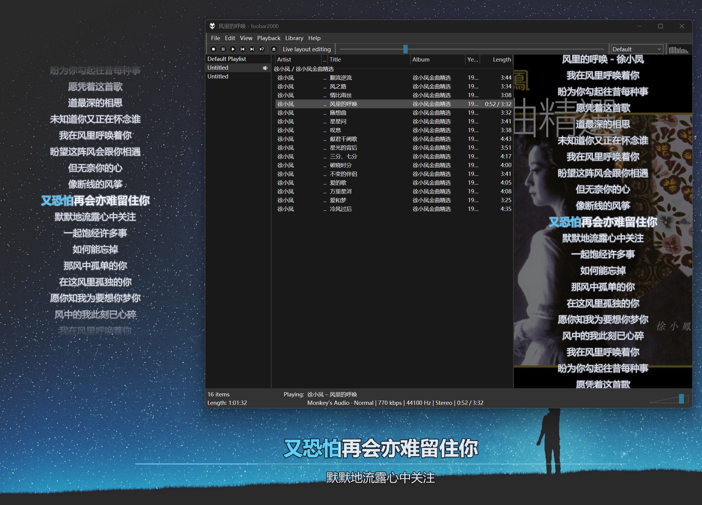

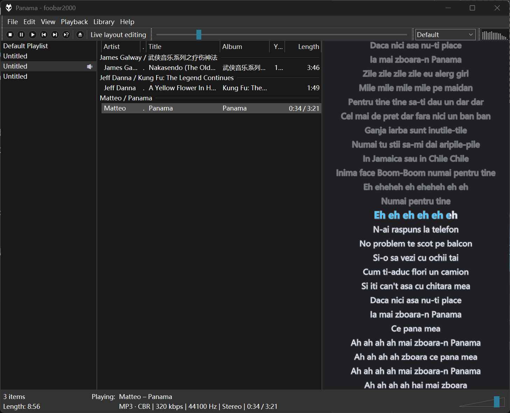

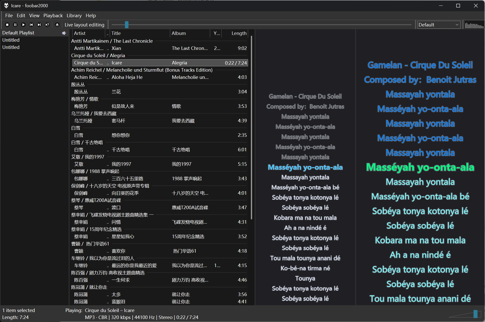

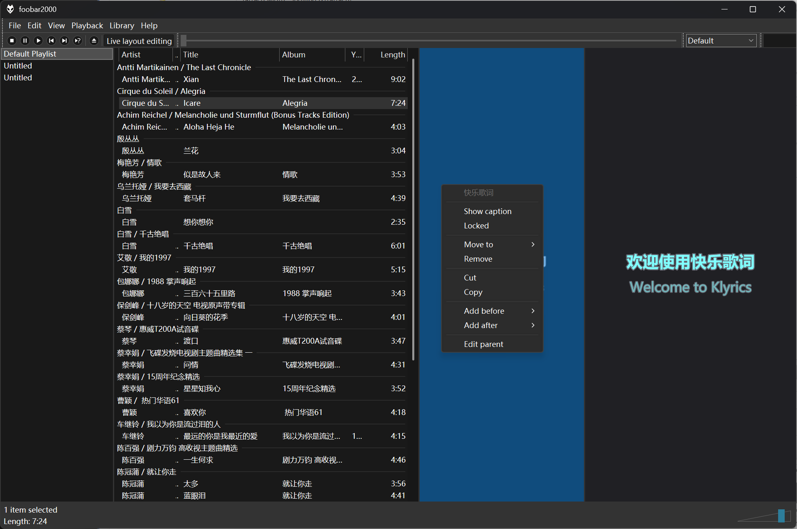

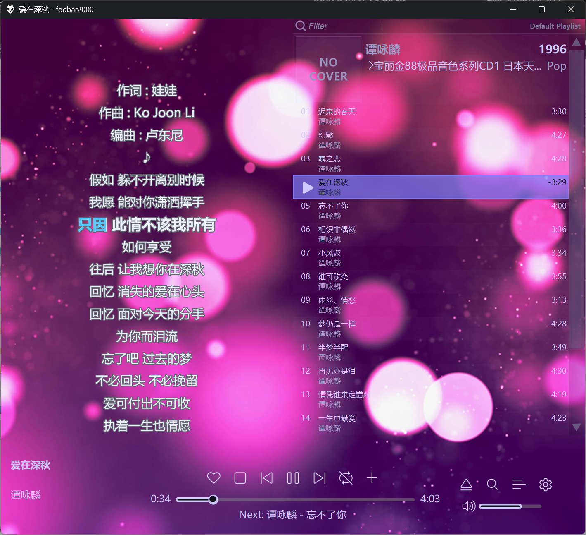

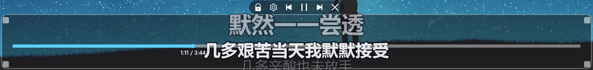


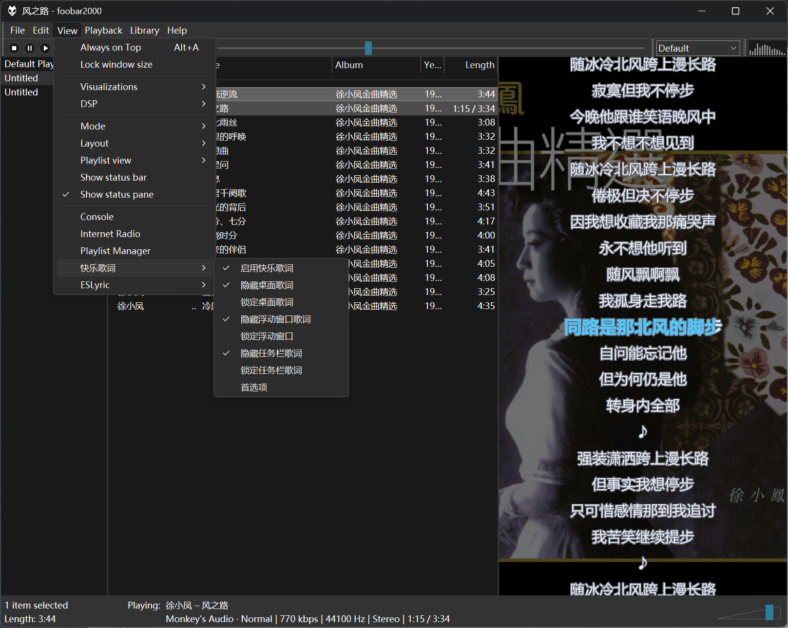

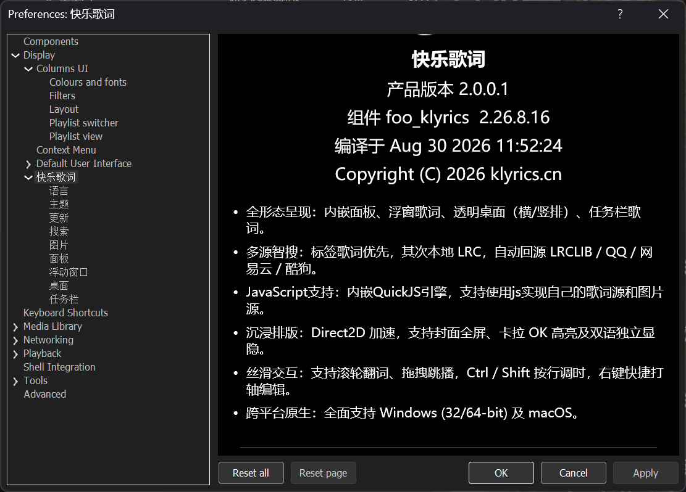

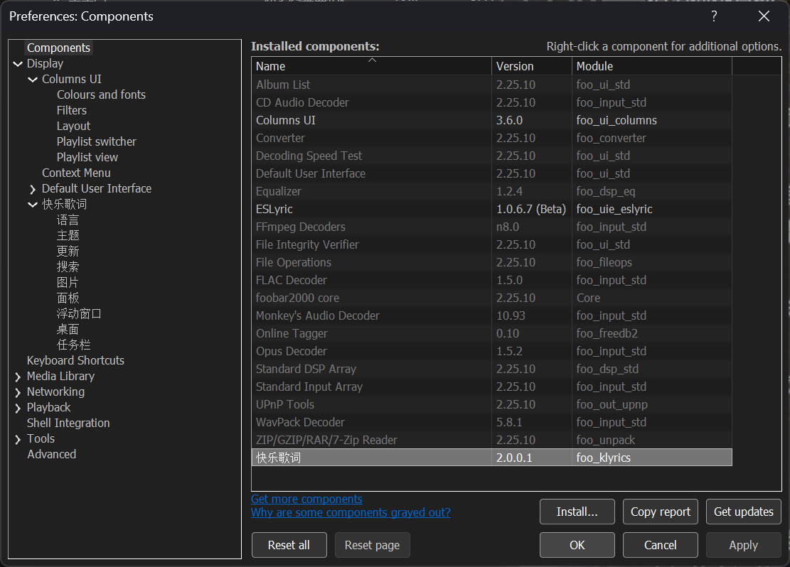

### macOS

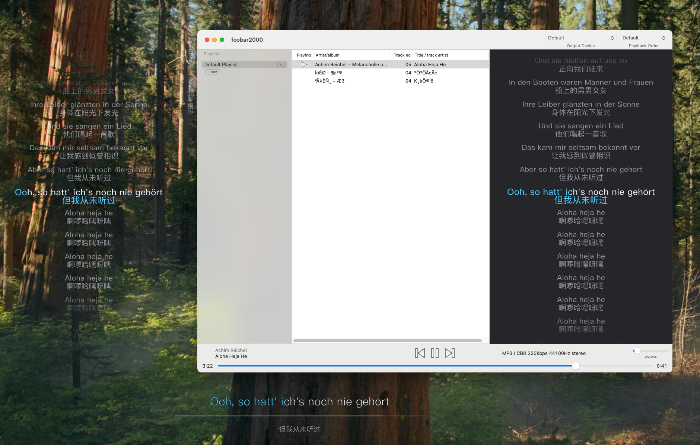

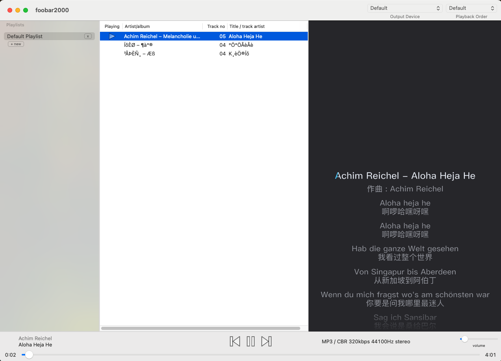

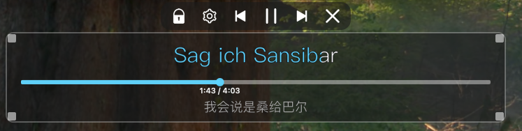

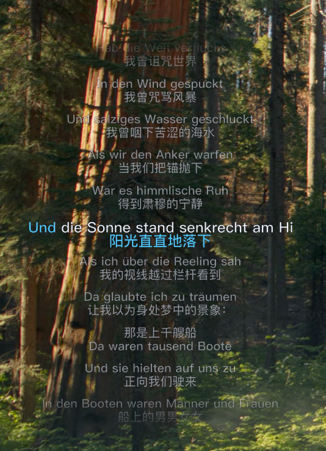

## 支持的播放器

| 项目 | 要求 |
| --- | --- |
| 系统 | Windows 10 / 11；macOS 11+ |
| 播放器 | **Windows：foobar2000 2.0 及以上**（32 位与 64 位均可）；**Mac：foobar2000 2.6 及以上** |
| 界面 | Windows：**Default UI** 与 **Columns UI** 均可嵌面板（CUI 需另装 [Columns UI](https://yuo.be/columns-ui)）。macOS 走播放器自带布局 |
| 不支持 | foobar2000 1.x；Windows 组件不能装到 Mac，反之亦然；任务栏歌词不做竖条任务栏，macOS 无任务栏歌词 |

32 位与 64 位是两份 DLL，不能混用。

| 播放器 | 组件文件 | 安装目录 |
| --- | --- | --- |
| foobar2000 2.x **32 位** | `foo_klyrics.dll` | `%APPDATA%\foobar2000-v2\user-components\foo_klyrics\` |
| foobar2000 2.x **64 位** | `foo_klyrics.dll` | `%APPDATA%\foobar2000-v2\user-components-x64\foo_klyrics\` |
| foobar2000 **Mac** | `foo_klyrics.component` | `~/Library/foobar2000-v2/user-components/` |

## 安装

1. 打开本仓库的 **Releases** 页，下载对应系统的包。
2. 在 foobar 里：**文件 → 首选项 → 组件 → 安装**，选中下载的 DLL / `.fb2k-component` / `.component`。Windows 若把 32 位和 64 位 DLL 放在同一目录（或打成一个 `.fb2k-component`），安装时会按位数自动选用。
3. 也可把文件手动拷到上表目录后**重启** foobar2000。

64 位 Windows 常见路径：

```
C:\Users\<用户名>\AppData\Roaming\foobar2000-v2\user-components-x64\foo_klyrics\foo_klyrics.dll
```

旧目录 `foo_klrc` 或旧文件 `foo_klrc.dll` / `foo_klrc64.dll` 请删掉，避免同时加载两份。

加入面板：

| 界面 | 做法 |
| --- | --- |
| **Default UI（DUI）** | 布局编辑模式 → 插入 UI 元素 **快乐歌词** |
| **Columns UI（CUI）** | 先安装 Columns UI，在首选项「显示」里把用户界面模块改成 Columns UI 并重启。布局编辑 → 添加面板 → **Panels** → **快乐歌词** |

布局编辑时，在歌词面板上右键是 foobar 自己的剪切 / 替换，不会弹出快乐歌词菜单。可并排多块，各块可单独「此面板外观」。

桌面歌词、任务栏歌词、菜单和首选项不依赖 DUI/CUI。任务栏歌词仅 Windows。

## 功能

- **面板**：跟播滚动、卡拉 OK 高亮、封面/歌手图、双语成对显示。可并排多块并各订外观；双击或右键全屏，ESC 退出。查看菜单 / 右键「启用快乐歌词」是总开关
- **桌面歌词**：平时透明，悬停出底栏；可选横排/竖排、进度条、KTV 描边、3D 阴影、图像填充。暂停/停止后可收到半透明
- **浮动窗口**：独立无边框窗，平时全透明，悬停出半透明底和工具栏（不画进度条）
- **任务栏歌词**（仅 Windows）：贴在任务栏空位上的一行歌词
- **搜词**：本地 `.lrc` 与「使用中」的源（出厂含网易云 / 酷狗 / QQ 逐字脚本，再 LRCLIB / 酷狗 / QQ / 网易云 / 内嵌歌词）；未加入的源不搜。手动搜索可预览再选用。搜到的词可保存为 `.lrc` 或写入音乐标签
- **搜图**：iTunes 等来源；与搜词分开
- **打轴编辑**：给无时间戳或要重打的歌词标时间

查看菜单分组名跟界面语言走：中文 **快乐歌词**，英文 **Klyrics**。

### 歌词从哪来

打开歌曲后按顺序找，都没有再按首选项「使用中」的源自动搜（合并后取最好的一条，不弹窗）：

1. 歌曲所在目录
2. 保存目录下 `lyrics/<歌手>/`
3. 设置里的额外路径
4. 使用中的搜索源，按列表顺序（出厂：网易云 / 酷狗 / QQ 逐字，再 LRCLIB / 酷狗 / QQ / 网易云）。逐字脚本把各厂格式转成 Enhanced LRC 再绘制。内嵌歌词与在线源并列，默认在可用源，只有加入使用中才会读。已保存过源列表的：到搜索页把新源从「可用」移入「使用中」

搜索页可选保存到 `.lrc` 或写入音乐标签；面板右键「把歌词写入音乐文件」随时写当前词。外置 CUE 写到镜像音频的分轨字段，不改 `.cue` 文本。`.lrc` 认 `[mm:ss.xx]` 行戳和行内 `<mm:ss.xx>` 字戳（一句一行的 Enhanced LRC），面板不画标签。

### 面板拖动

仅内嵌面板。单击不移动则忽略。

| 键 | 松手 |
| --- | --- |
| 无 | 跳到预览时间 |
| Ctrl | 全体时间按准星那一句的句首对齐到此刻 |
| Shift | 从准星那一行起到结尾，同样按句首对齐 |

### 打轴快捷键

编辑窗口有焦点时生效（不要用空格打点）。

| | Windows | macOS |
| --- | --- | --- |
| 打点并跳下一行 | F8 | Opt+D |
| 重打当前行 | Shift+F8 | Shift+Opt+D |
| 清除时间戳 | F7 | Opt+A |
| 当前行 ±0.2 秒 | Ctrl+− / Ctrl++ | Opt+W / Opt+S |

Mac 上 F7 / F8 是系统媒体键，不能用来打轴。

## 首选项

**文件 → 首选项 → 显示 → 快乐歌词**

语言、搜索、图片、面板、浮动窗口、桌面、任务栏（仅 Windows）。Windows 上改完要点「应用」；macOS 上改完立刻生效。

默认下载目录：Windows `%ALLUSERSPROFILE%\Klyrics\download`，macOS `~/Library/Application Support/Klyrics`。

## 社区脚本

LRCLIB、酷狗、QQ、网易云是组件内置的，不能用脚本覆盖。额外的歌词源或图片源可以写成 `.js` 放进：

- Windows：`%APPDATA%\foobar2000-v2\klyrics-data\scripts\`
- macOS：`~/Library/foobar2000-v2/klyrics-data/scripts/`

本仓库 [`scripts/`](scripts/) 里有示例：`lyricsovh.js`（歌词）、`netease-yrc.js` / `kugou-krc.js` / `qq-qrc.js`（逐字 → Enhanced LRC）、`deezerart.js`（封面/歌手图）。拷进去后重启 foobar，在「搜索」或「图片」页把新源移到「使用中」。

编写说明：[社区脚本编写指南](docs/script-guide.md)。
