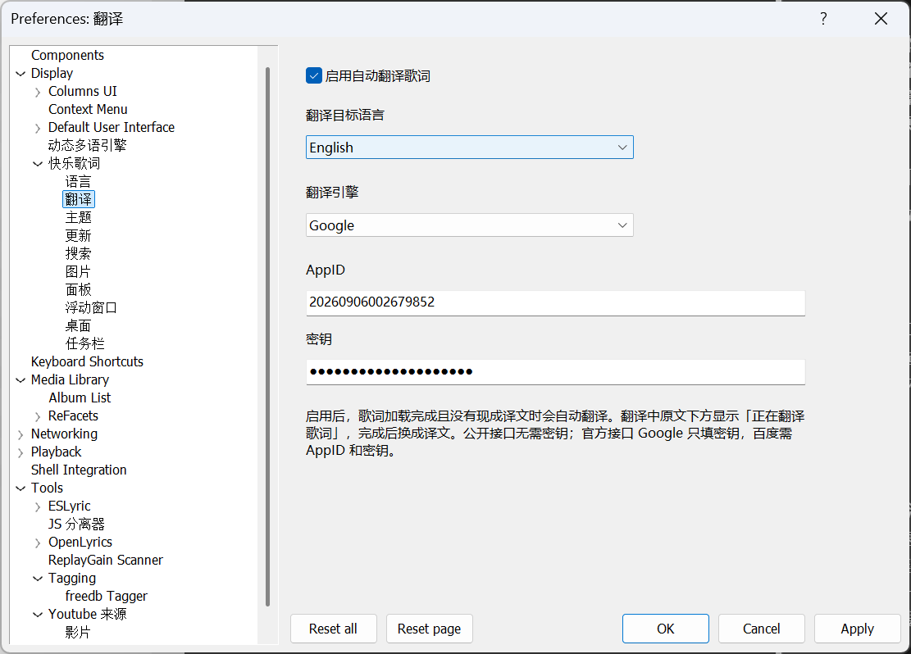

<p align="right"><a href="README.md">English</a> · <b>中文</b></p>

# 快乐歌词（foo_klyrics）

foobar2000 视觉歌词组件：内嵌面板、透明桌面歌词、Windows 任务栏歌词。歌词来自本地 `.lrc` / `.ttml` 和首选项「使用中」的源。出厂先走网易云 / 酷狗 / QQ **逐字**社区脚本，再 [LRCLIB](https://lrclib.net)、酷狗、QQ、网易云逐行源；内嵌歌词、amlldb TTML、YouTube 字幕默认在可用源。未加入的源不会搜。支持标准 LRC、Enhanced LRC（行内 `<>` 逐字时间）和 Apple / AMLL 歌词 TTML（注音、译文、罗马音可右键勾选）；卡拉 OK 有字戳则按字形裁到当前字。英文显示名 **Klyrics**。

当前组件文件版本：Windows `2.26.9.14`，macOS `2.26.9.14`。产品版 `2.0.0.12`。

本仓库只托管**编译包**和开源的社区 JS 脚本，不公开插件源码。安装包在仓库的 **Releases** 页。

## 更新

### 2.0.0.12（2026-09-13）

- 桌面歌词行间距可调；成对显示时两行间距跟随该设置
- 歌词服务增加接口命令：静默搜词、选歌词 / 编辑窗、图层、保存、偏好页、桌面 / 浮窗 / 任务栏显示与锁定、跳转进度、面板样式
- COM 内嵌类型库，兼容 JSplitter 3.8+
- Windows / macOS 增加本机 WebSocket 服务（默认 `127.0.0.1:9999`，偏好「更新」页可关或改端口）
- 提供了使用WebSocket歌词客户端 `klyrics_client.js,` 并用这个客户端实现了绘制歌词的demo(klyrics.js和klyrics.html)


### 2.0.0.11（2026-09-12）

- 桌面歌词支持了新的对齐方式和切行效果
- 把偏好页的页签改成了偏好树里的独立子页
- 「面板」改名为「面板模板」，只作为新建面板时的默认外观


### 2.0.0.10（2026-09-12）

- 修复2.0.0.9版本的bug: 32位版本，fb2k 2.x版本CUI界面找不到歌词面板
- 首次安装时的默认值有误，已修复为套用 Classic Dark 主题
- 在偏好页，歌词改为挂在"Tools"节点，不再挂载在"Display"节点
- 现在OBS(或基于OBS开发的抖音直播伴侣等直播软件)能捕获桌面歌词窗口和浮动歌词窗口
- 图片页只控制搜索，是否画背景图由各窗口自己的背景模式决定
- 面板 / 浮窗背景增加「图片」：可用自动搜索的专辑封面或歌手照片，或指定一张图；显示方式为居中、拉伸、填充、平铺
- 搜索页增加「过滤」：标题或专辑名包含列表中的文字则跳过自动搜词（忽略大小写；专辑为空时不按专辑过滤；手动搜索不受影响）
- 面板和浮窗增加了2种新特效: 扇形、拨盘


### 2.0.0.9（2026-09-11）

- 增加在线翻译歌词的功能，自动把搜索到的歌词翻译成目标语言
- 其他组件和 JScript Panel 可通过 COM（`Klyrics.Engine`）拉取当前歌词（仅 Windows）
- 两个推送：加载成功（行数、歌词文件路径；内嵌或未保存到文件时路径为空）；播放切行时推当前行（行号、时间、原文、译文）


### 2.0.0.8（2026-09-10）

- 重大调整：旧版本的字号按照ps计算，已调整为按照px计算
- 适配了Intel和Arm架构的macOS
- 适配了foobar-sdk 1.x，支持 foobar2000 1.x版本
- 新增 LyricsMania、Dark Lyrics、歌詞 Wiki 三个社区纯文本歌词源（默认在可用源）
- 描边宽度可调，出厂改为不描边；优化了描边算法
- 歌词行间距按像素设置（出厂 4px）；双语的原文与译文、折行后的各行都更紧凑
- 「超宽自动折行」出厂改为开
- macOS 面板右键菜单与 Windows 对齐，去掉「跟随全局设置」

出厂默认改了，但不会动你已保存的设置。想要新观感，到**首选项 → 显示 → 快乐歌词 → 主题**里点一次「应用」。

### 2.0.0.7（2026-09-06）

- 新增鱼眼、旋转唱片特效
- 优化了上下文菜单项的设计，优化了偏好页窗口的布局
- 增加不自动保存歌词的选项，保存歌词的缺省选项仍是保存到指定目录
- 主题增加「跟随 foobar2000」，套用全局的字体和颜色


### 2.0.0.6（2026-09-05）

- 支持 Apple / AMLL TTML：本地解析 `.ttml`（注音、译文、罗马音），并增加 amlldb TTML 词源（默认在可用源）
- 面板 / 浮窗平滑滚动：切行不再停顿，间奏匀速跟进
- YouTube 字幕源：标题栏可贴 watch / Music 链接；没有 CC 时改拉 YouTube Music 逐行歌词（标准 LRC）
- 星球大战特效（Windows 面板 / 浮窗）：整屏一条斜率，当前行与走过的行同一透视，近处不再对折放大
- 本地歌词与内嵌并列，须加入「使用中」才会搜


### 2.0.0.5（2026-09-04）

- 面板 / 浮窗可开「超宽自动折行」（默认关）：按窗口宽度折行，每条文本最多 3 行；打开后不再左右跟随
- 影响歌词绘制的字体、颜色、样式都进主题（含折行）；套用 / 导出都会带上
- 桌面 / 任务栏描边改为同一轮廓绘制，减轻毛刺
- 默认保存目录只建在配置目录 `klyrics-data/download`，不再建 ProgramData / Application Support 或软连接
- 搜到的歌词可写到歌曲所在目录；中文界面不再落到英文文案


### 2.0.0.4（2026-09-03）

- 出厂搜索源改为网易云 / 酷狗 / QQ 逐字脚本，再 LRCLIB 与各厂逐行源；逐字转成 Enhanced LRC 再绘制
- 有字戳时卡拉 OK 按字形裁到当前字；暂停/停止后桌面歌词可淡到半透明
- 默认保存目录改为 foobar 配置目录下的 `klyrics-data/download`，启动时联到共享目录（Windows：`%ALLUSERSPROFILE%\Klyrics\download`；macOS：`~/Library/Application Support/Klyrics`）
- 出厂社区脚本打进组件，首次启动时写入 `klyrics-data/scripts/`（已有文件不覆盖）
- 歌词搜索窗口可打开「首选项」并切到搜索页


### 2.0.0.3（2026-09-01）

- 内嵌歌词改为可选搜索源（默认在可用源，加入使用中后按列表顺序使用）
- 搜索页可「写入到音乐标签」；面板右键「把歌词写入音乐文件」
- 外置 CUE 分轨：词写到镜像音频的分轨字段，搜索内嵌时从镜像读；正在播放该镜像时可能顿一下


### 2.0.0.2（2026-08-31）

- 布局里可放多块面板，各块可「此面板外观」单独设置，或「跟随全局设置」
- 双击面板或右键「全屏」，ESC 退出（另开覆盖窗，不改布局）
- 查看菜单 / 面板右键增加「启用快乐歌词」总开关
- 布局编辑时右键交给 foobar，可剪切 / 替换，不再被组件菜单挡住
- 浮窗悬停改为半透明圆角底 + 工具栏 + 四角锚点，不再画进度条、不再压暗歌词


## 截图


### Windows





### macOS


## 支持的播放器


| 项目  | 要求                                                                                                            |
| --- | ------------------------------------------------------------------------------------------------------------- |
| 系统  | Windows 10 / 11；macOS 11+                                                                                     |
| 播放器 | **Windows：foobar2000 2.0 及以上**（32 位与 64 位均可）；**Mac：foobar2000 2.6 及以上**                                       |
| 界面  | Windows：**Default UI** 与 **Columns UI** 均可嵌面板（CUI 需另装 [Columns UI](https://yuo.be/columns-ui)）。macOS 走播放器自带布局 |
| 不支持 | foobar2000 1.x；Windows 组件不能装到 Mac，反之亦然；任务栏歌词不做竖条任务栏，macOS 无任务栏歌词                                              |


32 位与 64 位是两份 DLL，不能混用。


| 播放器                     | 组件文件                    | 安装目录                                                       |
| ----------------------- | ----------------------- | ---------------------------------------------------------- |
| foobar2000 2.x **32 位** | `foo_klyrics.dll`       | `%APPDATA%\foobar2000-v2\user-components\foo_klyrics\`     |
| foobar2000 2.x **64 位** | `foo_klyrics.dll`       | `%APPDATA%\foobar2000-v2\user-components-x64\foo_klyrics\` |
| foobar2000 **Mac**      | `foo_klyrics.component` | `~/Library/foobar2000-v2/user-components/`                 |


## 安装

1. 打开本仓库的 **Releases** 页，下载对应系统的包。
2. 在 foobar 里：**文件 → 首选项 → 组件 → 安装**，选中下载的 DLL / `.fb2k-component` / `.component`。Windows 若把 32 位和 64 位 DLL 放在同一目录（或打成一个 `.fb2k-component`），安装时会按位数自动选用。
3. 也可把文件手动拷到上表目录后**重启** foobar2000。

64 位 Windows 常见路径：

```
C:\Users\<用户名>\AppData\Roaming\foobar2000-v2\user-components-x64\foo_klyrics\foo_klyrics.dll
```

旧目录 `foo_klrc` 或旧文件 `foo_klrc.dll` / `foo_klrc64.dll` 请删掉，避免同时加载两份。

加入面板：


| 界面                  | 做法                                                                                   |
| ------------------- | ------------------------------------------------------------------------------------ |
| **Default UI（DUI）** | 布局编辑模式 → 插入 UI 元素 **快乐歌词**                                                           |
| **Columns UI（CUI）** | 先安装 Columns UI，在首选项「显示」里把用户界面模块改成 Columns UI 并重启。布局编辑 → 添加面板 → **Panels** → **快乐歌词** |


布局编辑时，在歌词面板上右键是 foobar 自己的剪切 / 替换，不会弹出快乐歌词菜单。可并排多块，各块可单独「此面板外观」。

桌面歌词、任务栏歌词、菜单和首选项不依赖 DUI/CUI。任务栏歌词仅 Windows。

## 功能

- **面板**：跟播滚动、卡拉 OK 高亮、封面/歌手图、双语成对显示。背景可选主题 / 透明 / 自定义颜色 / 图片（居中、拉伸、填充、平铺）。可并排多块并各订外观；超宽自动折行默认开，可关。双击或右键全屏，ESC 退出。查看菜单 / 右键「启用快乐歌词」是总开关。Windows / macOS 均可开星球大战、鱼眼、唱片特效（开特效后锁定始终平滑滚动）；唱片可另选背景图（默认无）；样图在 `[extras/](extras/)`
- **桌面歌词**：平时透明，悬停出底栏；可选横排/竖排、进度条、KTV 描边、3D 阴影、图像填充。暂停/停止后可收到半透明
- **浮动窗口**：独立无边框窗，平时全透明，悬停出半透明底和工具栏（不画进度条）；背景同样可选主题 / 透明 / 自定义颜色 / 图片；本页可单独开超宽自动折行和特效
- **任务栏歌词**（仅 Windows）：贴在任务栏空位上的一行歌词
- **搜词**：本地 `.lrc` / `.ttml` 与「使用中」的源（出厂含网易云 / 酷狗 / QQ 逐字脚本，再 LRCLIB / 酷狗 / QQ / 网易云 / 内嵌歌词 / amlldb TTML / YouTube 字幕）；未加入的源不搜。搜索子页「过滤器」可按标题或专辑跳过自动搜（忽略大小写；专辑为空时不按专辑过滤）；手动搜索可预览再选用。搜到的词可四选一保存：不自动保存 / 写入音乐标签 / 歌曲所在目录 / 指定位置
- **搜图**：iTunes 等来源；与搜词分开
- **打轴编辑**：给无时间戳或要重打的歌词标时间
- **在线翻译**：搜索到的歌词可自动译成目标语言（百度 / 谷歌等，见首选项「翻译」）
- **对外接口**：C++ SDK（Windows / macOS）、COM `Klyrics.Engine`（仅 Windows，给 JScript Panel 等用）、本机 WebSocket（`127.0.0.1:9999`，可关）。可拉取当前歌词，也可搜词、开窗口、改图层、保存、打开偏好页、控制桌面 / 浮窗 / 任务栏。说明见 [歌词服务 SDK](docs/sdk.md)，头文件 [sdk/klyrics_api.h](sdk/klyrics_api.h)

查看菜单分组名跟界面语言走：中文 **快乐歌词**，英文 **Klyrics**。

### 歌词从哪来

打开歌曲后按顺序找，都没有再按首选项「使用中」的源自动搜（合并后取最好的一条，不弹窗）。标题或专辑名包含搜索 → 过滤器列表中的文字则跳过自动搜（忽略大小写；专辑为空时不按专辑过滤）。本地已有词仍会加载；手动「搜索歌词」不拦。跳过时面板只显示歌曲信息。

1. 歌曲所在目录
2. 保存目录下 `lyrics/<歌手>/`
3. 设置里的额外路径
4. 使用中的搜索源，按列表顺序（出厂：网易云 / 酷狗 / QQ 逐字，再 LRCLIB / 酷狗 / QQ / 网易云）。逐字脚本把各厂格式转成 Enhanced LRC 再绘制。内嵌歌词、amlldb TTML、YouTube 字幕与在线源并列，默认在可用源，只有加入使用中才会读。已保存过源列表的：到搜索 → 搜索源把新源从「可用」移入「使用中」

搜索 → 保存歌词四选一：不自动保存 / 写入音乐标签 / 歌曲所在目录 / 指定位置；面板右键「把歌词写入音乐文件」随时写当前词。外置 CUE 写到镜像音频的分轨字段，不改 `.cue` 文本。`.lrc` 认 `[mm:ss.xx]` 行戳和行内 `<mm:ss.xx>` 字戳（一句一行的 Enhanced LRC）；本地还认 Apple / AMLL `.ttml`（注音、译文、罗马音可在「歌词语言」里勾选）。保存仍写 `.lrc`，不回写 TTML。

### 面板拖动

仅内嵌面板。单击不移动则忽略。


| 键     | 松手                 |
| ----- | ------------------ |
| 无     | 跳到预览时间             |
| Ctrl  | 全体时间按准星那一句的句首对齐到此刻 |
| Shift | 从准星那一行起到结尾，同样按句首对齐 |


### 打轴快捷键

编辑窗口有焦点时生效（不要用空格打点）。


|            | Windows         | macOS         |
| ---------- | --------------- | ------------- |
| 打点并跳下一行    | F8              | Opt+D         |
| 重打当前行      | Shift+F8        | Shift+Opt+D   |
| 清除时间戳      | F7              | Opt+A         |
| 当前行 ±0.2 秒 | Ctrl+− / Ctrl++ | Opt+W / Opt+S |


Mac 上 F7 / F8 是系统媒体键，不能用来打轴。

## 首选项

**文件 → 首选项 → 工具 → 快乐歌词**

语言、翻译、主题（可套用「跟随 foobar2000」）、搜索、图片、面板模板、浮动窗口、桌面、任务栏（仅 Windows）。搜索本页只留「新曲开始时…」；保存歌词 / 额外搜索目录 / 搜索源 / 过滤器是下级子页。面板模板 / 浮窗 / 桌面 / 任务栏本页放字体和颜色，效果单独一页。面板 / 浮窗背景可选主题、透明、自定义颜色或图片。图片页只控制搜索。影响歌词绘制的字体、颜色、样式都进主题（含折行）。Windows 上改完要点「应用」；macOS 上改完立刻生效。首次安装套用 Classic Dark。

默认下载目录：foobar 配置目录下的 `klyrics-data/download`（普通文件夹，不再建 ProgramData 或软连接）。

## 社区脚本

LRCLIB、酷狗、QQ、网易云是组件内置的，不能用脚本覆盖。额外的歌词源或图片源可以写成 `.js` 放进：

- Windows：`%APPDATA%\foobar2000-v2\klyrics-data\scripts\`
- macOS：`~/Library/foobar2000-v2/klyrics-data/scripts/`

本仓库 `[scripts/](scripts/)` 里有示例：`lyricsovh.js`（歌词）、`netease-yrc.js` / `kugou-krc.js` / `qq-qrc.js`（逐字 → Enhanced LRC）、`amlldb-ttml.js`（amlldb TTML）、`youtube-captions.js`（YouTube CC / Music 逐行歌词）、`lyricsmania.js` / `darklyrics.js` / `lyricsfandom.js`（三个纯文本歌词站）、`deezerart.js`（封面/歌手图）。拷进去后重启 foobar，在「搜索」或「图片」页把新源移到「使用中」。

编写说明：[社区脚本编写指南](docs/script-guide.md)。

## 歌词服务 SDK

其他组件可以读取 Klyrics 已经解析、对齐、翻译后的歌词，也可以发服务命令（静默搜词、选歌词 / 编辑窗、图层、保存、偏好页、桌面 / 浮窗 / 任务栏、面板样式）。C++ 头文件：[sdk/klyrics_api.h](sdk/klyrics_api.h)。完整说明、COM / WebSocket 对照与 JScript Panel Demo：[歌词服务 SDK](docs/sdk.md)。浏览器画布示例：[sdk/klyrics.html](sdk/klyrics.html)（[sdk/klyrics_client.js](sdk/klyrics_client.js) 接口层 + [sdk/klyrics.js](sdk/klyrics.js) 绘制）。

## 唱片背景图

唱片特效默认没有背景图。需要时从本仓库 `[extras/](extras/)` 下载 `disk1c.png`（或同目录其它唱片图），在面板 / 浮窗「特效 → 属性」里选为背景。